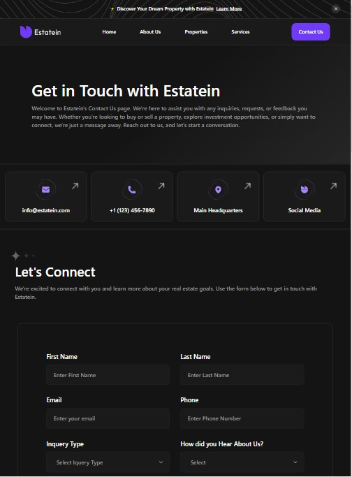
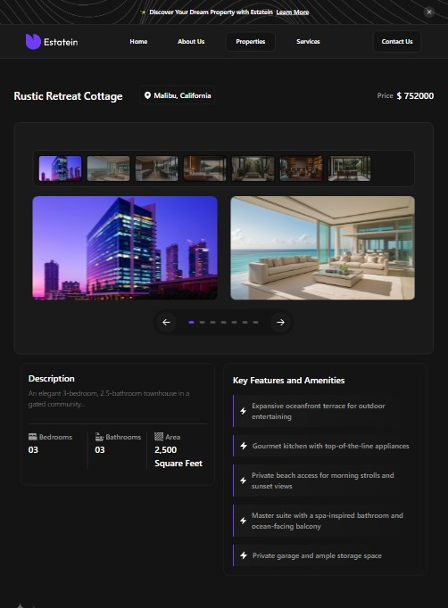

# 🏡 Estatein — Real Estate Landing Page

Estatein is a modern, responsive real estate landing page built with **Next.js** and **Tailwind CSS**. This project was created for my portfolio to demonstrate frontend development skills, including layout, animations, responsive design, and UI composition.

### 🔗 Live Demo
[https://estatein-real-estate.netlify.app](https://estatein-real-estate.netlify.app)

### 💻 Tech Stack
- **Next.js 14**
- **React 18**
- **Tailwind CSS**
- **Vercel / Netlify for deployment**

---

### ✨ Features

- Fully responsive layout for desktop & mobile
- Animated transitions and scroll-based effects
- Modular component-based architecture
- Semantic HTML structure
- Accessible UI and readable structure
- Modern and clean design

---

### 📸 Screenshots




---

### 🧠 What I Learned

- Practiced responsive design with Tailwind
- Worked with reusable UI components
- Learned how to structure a landing page project with Next.js
- Improved layout techniques and animation integration

---

### 📂 Folder Structure

```bash
📂 app
 ├── about
 ├── contact
 └── home
📂 components
📂 constants
📂 public
📂 styles
```

---

### 📌 Notes 

- This is a frontend-only project.

- No authentication or backend is implemented.

- Designed for showcasing layout & UI design skills.

- Designed by Praha | Produce UI [https://www.figma.com/community/file/1314076616839640516/real-estate-business-website-ui-template-dark-theme-produce-ui](https://www.figma.com/community/file/1314076616839640516/real-estate-business-website-ui-template-dark-theme-produce-ui)

---

### 🚀 Getting Started

```bash
git clone https://github.com/whitepink1/real-estate.git
cd real-estate
npm install
npm run dev